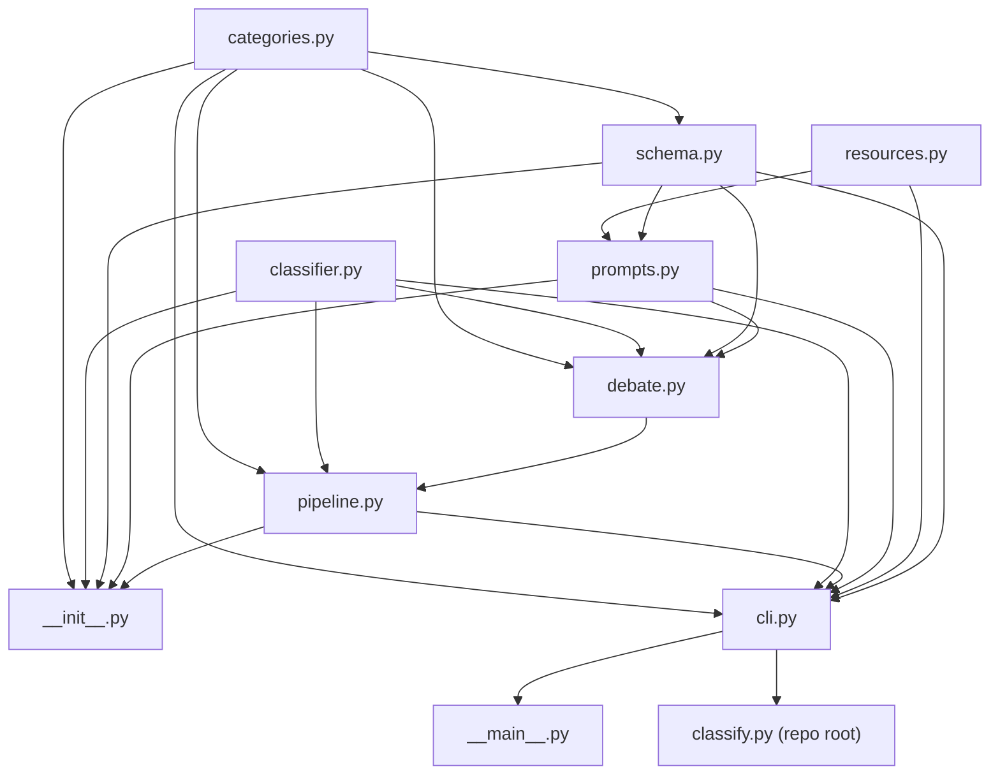

# Architecture: ds-query-classification

> Prescriptive constraints for this codebase. What currently exists is documented in `spec/docs/` (not yet generated — run `/spec-docs --full`).
> Changes to invariants require an ADR (`spec/{spec_name}/ADR.md`); accepted ADRs are folded in by `/spec-close`.

## Overview

A single-package batch CLI: read a CSV, classify one text column against a user-defined
set of categories via an LLM (through LiteLLM), write the labeled CSV back out. The
domain is never hard-coded — categories (JSON) and an optional task description (text
file) are supplied at runtime, and a Pydantic output schema + system prompt are built
dynamically from them. There is no server, database, or persisted state beyond the
input/output CSVs.

Below, a dependency arrow `A --> B` means **"B imports A"** (arrow points from the
imported/lower-level module to its importer).

## Module Boundary Map

| Module / path | Responsibility | May import from | Must NOT import from |
|---|---|---|---|
| `src/query_classification/categories.py` | Load + validate categories JSON into `Category`/`Label` Pydantic models | stdlib, pydantic | any sibling module |
| `src/query_classification/classifier.py` | Single-text LLM call (`Classifier`): structured output + JSON-mode fallback + bounded retries | stdlib, litellm, pydantic | any sibling module |
| `src/query_classification/schema.py` | Dynamically build the `ClassificationResult` Pydantic model from categories | `categories.py` | `prompts.py`, `pipeline.py`, `cli.py` |
| `src/query_classification/resources.py` | Compute `PROJECT_ROOT` + default resource paths | stdlib only | any sibling module |
| `src/query_classification/prompts.py` | Render the system prompt template | `schema.py`, `resources.py` | `pipeline.py`, `cli.py` |
| `src/query_classification/pipeline.py` | Threaded CSV batch loop (`classify_csv`): restore/limit/incremental save | `categories.py`, `classifier.py`, `debate.py` | `schema.py`, `prompts.py`, `cli.py` |
| `src/query_classification/debate.py` | Per-row self-consistency sampling, consensus voting, and Critic/Reconciler debate orchestration for `--critics` mode | `categories.py`, `classifier.py`, `schema.py`, `prompts.py` | `pipeline.py`, `cli.py` |
| `src/query_classification/cli.py` | argparse entry point; wires every module together | `categories.py`, `classifier.py`, `pipeline.py`, `prompts.py`, `resources.py`, `schema.py` | (top of the graph — nothing above it) |
| `src/query_classification/__init__.py` | Re-exports the public API | `categories.py`, `schema.py`, `prompts.py`, `classifier.py`, `pipeline.py` (exactly these 5 — verified by reading its import block; it does **not** import `cli.py` or `resources.py`) | `cli.py` |
| `src/query_classification/__main__.py` | `python -m query_classification` | `cli.py` | — |
| `classify.py` (repo root) | `python classify.py` script entry point; sys.path-injects `src/` (`classify.py:13`) so it works with or without an editable install | `cli.py` | — |
| `tests/` | Unit tests | public package API (`query_classification`), **and** `resources.py` directly (an established, observed exception — see INV-7) | other internal modules directly (`categories.py`/`schema.py`/`classifier.py`/`pipeline.py`/`cli.py`) |
| `resources/categories/*.json`, `resources/prompts/*.txt` | Hand-authored config (taxonomy, prompt template) | — (data, not code) | — |
| `data/`, `output/` | Only `output/` is gitignored/generated-only (`.gitignore:19`); `data/` is **not** gitignored and may legitimately hold user-supplied input CSVs alongside pipeline-written outputs — see Known Gaps below for what's actually inferrable | — | — |

**Shared files** (multiple areas touch these — sequence tasks that modify them):
- `resources/prompts/system_prompt.txt` — the `{task_description}`/`{schema_description}` template consumed by `prompts.py`, defaulted in `resources.py`, and asserted to exist by `tests/test_building_blocks.py::test_bundled_resources_exist`.
- `resources/categories/example_categories.json` (the *default* categories file per `resources.py:17`) and `resources/categories/example_support_tickets.json` (the one used in README/`install.sh` usage examples) — both must stay valid against the `Category`/`Label` schema in `categories.py`.
- `resources/prompts/example_task_description.txt` — referenced by README's "Reproducing the original decision-classification setup" example, exported as `EXAMPLE_TASK_DESCRIPTION_FILE` in `resources.py`, and asserted to exist by the tests.
- `.env` / `.env.example` — loaded by `cli.py` (`load_dotenv`) and read (as plain env vars, not via dotenv) by `classifier.py` (`_API_BASE_ENV_VARS`, `classifier.py:23-29`); the two must agree on which env var names matter.
- `pyproject.toml` and `requirements.txt` — duplicate the same runtime dependency list (litellm, pandas, pydantic, python-dotenv, tqdm + pytest) by hand; `install.sh` installs from `requirements.txt`, packaging/pytest config comes from `pyproject.toml`. Nothing enforces the two stay in sync.
- `README.md` and root `classify.py` — README's usage examples and Options table must stay in sync with `cli.py`'s actual flags (see Stable Contracts); `classify.py` is coupled to the src-layout (`src/query_classification/`) and to `cli.main`.

## Invariants

### INV-1: Internal dependency graph is one-directional and acyclic
- **Rule:** `categories.py` and `classifier.py` never import any sibling module; `schema.py` depends only on `categories.py`; `prompts.py` depends only on `schema.py`+`resources.py`; `debate.py` depends only on `categories.py`+`classifier.py`+`schema.py`+`prompts.py`; `pipeline.py` depends only on `categories.py`+`classifier.py`+`debate.py`; `__init__.py` depends on exactly the original 5 modules (`debate.py` is not re-exported — see INV-7); `cli.py` is the only module allowed to import all 7.
- **Why:** keeps the building blocks independently testable/reusable (this is exactly what `tests/test_building_blocks.py` exercises) and keeps the LLM/threading/CSV concerns decoupled from schema/prompt construction. `debate.py` composes the schema/prompt builders for `--critics` mode without `pipeline.py` needing to depend on `schema.py`/`prompts.py` directly, preserving that separation.
- **Evidence:** `schema.py:13`, `prompts.py:21-22`, `pipeline.py:16-17`, `cli.py:13-21`, `__init__.py:14-18`; `classifier.py` and `categories.py` have no `from query_classification...` imports. `debate.py` in practice imports only `categories.py`+`classifier.py` (a subset of what's authorized) — see `spec/1-initial-classification-with-critics/implementation-summary.md`'s Deviations section.
- *(amended by `spec/1-initial-classification-with-critics/ADR.md` ADR-001, 2026-09-08)*

### INV-2: All bundled default paths are computed once, in `resources.py`
- **Rule:** `resources.py` is the single source of truth for locating `resources/` (categories, prompts). No other module recomputes a path into `resources/` itself.
- **Why:** stated explicitly in the module docstring; prevents path-resolution drift between the CLI, `prompts.py`, and tests.
- **Evidence:** `resources.py:13-18`; `cli.py:17-20` and `prompts.py:21` both import the constants rather than deriving paths themselves.

### INV-3: Default resources only resolve in a source checkout or editable install — NOT in a built wheel
- **Rule:** `PROJECT_ROOT = Path(__file__).resolve().parents[2]` (`resources.py:13`) walks up from the installed file to what it assumes is the repo root, then into a top-level `resources/` directory. `resources/` lives outside the `query_classification` package and is not declared as package data anywhere in `pyproject.toml`. This is a deliberate, accepted limitation (not planned to be fixed by packaging `resources/` as wheel data) — a plain wheel install is not a supported install mode today; only source checkouts and editable installs (`pip install -e .`) are.
- **Why:** verified live in this session — built a real wheel (`pip wheel . --no-deps`) and inspected its contents: it contains only `query_classification/*.py` + dist-info, **zero** `resources/*.json`/`*.txt` files. After a normal (non-editable) wheel install, `PROJECT_ROOT` resolves into the Python installation's site-packages tree, where no `resources/` directory exists. `resources.check_default_resources_available()` now guards the CLI's default `--categories`/`--system-prompt` paths and raises a clear, actionable `FileNotFoundError` in that case instead of a bare one from deep inside `open()`/`read_text()`. Explicit `--categories`/`--system-prompt`/`--task-description` paths still work in any install mode, since those bypass the defaults (and the guard) entirely.
- **Evidence:** live wheel build + `zipfile` inspection this session; `resources.py:13-18` and `resources.check_default_resources_available()`; `cli.py`'s `uses_bundled_defaults` check before `load_categories`/`build_system_prompt`; no `[tool.setuptools.package-data]`/`include-package-data` in `pyproject.toml`.

### INV-4: A broad `except Exception` requires an inline justification
- **Rule:** Every `except Exception` (or equivalent broad catch) must carry `# noqa: BLE001` plus a same-line or adjacent comment stating why the broad catch is intentional.
- **Why:** established, consistently-followed convention at both existing sites; keeps broad catches auditable rather than silent. Note: this is a code-review convention, not lint-tool-enforced — no Ruff/Flake8 is configured in this repo (see Verification Commands).
- **Evidence:** `classifier.py:108` (`# noqa: BLE001 - retried and re-raised below`), `pipeline.py:89` (`# noqa: BLE001 - one bad row shouldn't abort the run`).

### INV-5: `Classifier` requires `max_retries >= 1`
- **Rule:** `Classifier.__init__` raises `ValueError` if `max_retries < 1`. `Classifier.classify` loops over `range(1, self.max_retries + 1)`; without the constructor guard, `max_retries <= 0` would mean the loop body never runs, `last_exc` stays `None`, and the trailing `assert last_exc is not None` would fire — an `AssertionError` instead of the underlying LLM/network error.
- **Why:** verified live in this session — before the guard was added, `Classifier(..., max_retries=0).classify(...)` raised `AssertionError`; now the constructor itself rejects it immediately with a clear message. `cli.py`'s `--retries` flag still has no argparse-level validation, but any bad value now surfaces as a clean `Error: max_retries must be >= 1, got 0` (caught by `cli.py`'s `except (ValueError, FileNotFoundError)`) rather than a crash deep in `classify()`.
- **Evidence:** `classifier.py:62` (the guard), `:105,129-130` (the loop); live reproduction this session.

### INV-6: `pipeline.py` mutates the DataFrame only on the main thread
- **Rule:** Worker threads run only the read-only `classifier.classify` call; all writes to `df` happen in the main thread as futures complete via `as_completed`. No locking is used for these DataFrame writes.
- **Why:** stated explicitly in a code comment; this is also what keeps output row order tied to input order regardless of LLM completion order. This does **not** imply `Classifier` itself is safe to call concurrently from multiple threads in general — that's a property of the LiteLLM client, which isn't verified here.
- **Evidence:** `pipeline.py:74-93` (comment above the `ThreadPoolExecutor` block, and the `df.at[idx, ...]` writes only inside the `for future in as_completed(...)` loop).

### INV-7: `tests/` uses the public API by default, with accepted direct-import exceptions
- **Rule:** New tests should import from `query_classification` (the package `__init__.py`). Accepted direct-import exceptions: `query_classification.resources` (resource-path constants needed for path-existence assertions); `query_classification.debate` (all functions — internal `--critics` orchestration, not part of the public API); and, specifically, `schema.build_critic_model`/`build_reconciler_model` and `prompts.build_critic_prompt`/`build_reconciler_prompt` (internal builder functions introduced alongside `debate.py`, not re-exported). The pre-existing `build_classification_model`/`build_system_prompt`/`schema_description` remain public-API-only. Do not import `categories.py`/`classifier.py`/`pipeline.py`/`cli.py` directly.
- **Why:** matches the existing test file exactly, including the exceptions — keeps tests resilient to internal refactors of which module owns what, as long as the public API (+ the named exceptions) shape holds. The `debate.py`/schema/prompts exceptions give far more precise failure localization for a feature with this many interacting pieces than only testing through the public API indirectly.
- **Evidence:** `tests/test_building_blocks.py:7-16` (public API import + direct `query_classification.resources` import); `tests/test_debate.py` (direct imports of `debate`, `build_critic_model`, `build_reconciler_model`, `build_critic_prompt`, `build_reconciler_prompt`).
- *(amended by `spec/1-initial-classification-with-critics/ADR.md` ADR-002, 2026-09-08)*

### INV-8: Category names must be unique and must not equal the input `--column`
- **Rule:** Category `name` values are used both as Pydantic model field names (via `create_model`) and as CSV output columns. Both collisions are now validated and rejected: `build_classification_model` raises `ValueError` listing any duplicate name(s) (`schema.py`, right before building `fields`); `classify_csv` raises `ValueError` if any category `name` equals `column` (`pipeline.py`, checked before the input CSV is even read).
- **Why:** verified live in this session, both before and after the fix — before: two `Category` objects both named `"x"` silently produced a single model field `x` carrying only the second category's description (the first was dropped), and a category named identically to `--column` caused that column to be nulled (`pipeline.py`, when not `--restore`) *before* it was read as the text to classify — corrupting the input with no error at all. After: both cases now raise a clear `ValueError` instead.
- **Evidence:** live reproduction (both the original bug and the fix) this session; `schema.py` (duplicate-name check via `collections.Counter`), `pipeline.py` (`column in category_names` check at the top of `classify_csv`).

### INV-9: `--limit 0` means zero rows; other numeric CLI parameters still have unvalidated edge behavior
- **Rule / current behavior:**
  - `--limit 0` now means **classify zero rows** — fixed to check `if limit is not None:` (was the falsy check `if limit:`, which treated `0` the same as "not given"). `--limit` omitted (`None`) still means no limit.
  - A negative `--limit` still slices `work_idx` from the end (Python slice semantics) rather than erroring — not changed.
  - `--workers <= 0` still silently becomes `1` (`max(1, workers)`, `pipeline.py`) — not changed, arguably reasonable as a floor rather than an error.
  - The library-only `save_every` parameter (no CLI flag exposes it) still raises `ZeroDivisionError` if passed `0` — not changed.
- **Why:** the `--limit 0` case was fixed because it directly contradicted the flag's own meaning (passing an explicit `0` silently did the opposite of limiting). The remaining three are lower-impact/harder-to-hit edge cases, left as documented current behavior rather than fixed in this pass.
- **Evidence:** `pipeline.py` (`if limit is not None:` truncation, `max(1, workers)`, `% save_every` modulo); `cli.py`'s `build_parser` (no validation on `--limit`/`--workers`/`--retries` ranges).

### INV-10: `--restore` now seeds already-classified rows from a separate prior `--output`, when row counts match
- **Rule:** `classify_csv` always calls `pd.read_csv(input_path)` fresh. When `restore=True` and `output_path` exists and differs from `input_path`, it now also reads `output_path` and copies its category columns into `df` (matched by row position) *before* deciding which rows are already done — so a prior run's `--output` file is honored on resume, not just the overwrite-in-place case. This requires the prior output to have the same row count as the current input; a mismatch raises a clear `ValueError` rather than silently misaligning rows.
- **Why:** previously, `output_path` and `input_path` were resolved independently and `df` was loaded only from `input_path`, so `--restore` with a separate `--output` silently repeated all work — verified live both before and after the fix.
- **Evidence:** `pipeline.py` (the `if restore and output_path.exists() and output_path.resolve() != input_path.resolve():` block, added before the existing `already_done` check); live reproduction this session (both the original bug and the fix).

### INV-11: The result schema enforces cardinality and type only — not label validity or the `none` convention
- **Rule:** `build_classification_model` (`schema.py:36-39`) enforces exactly two things per category field: the value is a `list[str]`, and its length is 1-3. It does **not** enforce that each string is one of the category's configured label values, does not forbid duplicate labels within the list, does not forbid combining `"none"` with a real label, and does not forbid the explicitly-discouraged `"none - <existing label>"` form. All of those are prompt-level conventions communicated to the LLM in `field_description` (`schema.py:27-35`) and the system prompt — never validated in code.
- **Why:** verified live in this session — `model.model_validate_json` accepted an invented label, a duplicated label, `"none"` alongside a real label, and `"none - positive"` (an existing label) without error.
- **Evidence:** live reproduction this session; `schema.py:36-39` (the only `Field` constraints present).

## Stable Contracts

- **Categories JSON format** — `{"categories": [{"name", "description", "labels": [{"value", "description"}]}]}`, defined by `Category`/`Label` in `categories.py:30-42`. Changing field names/shape breaks every existing `resources/categories/*.json` file and any user-supplied `--categories` file. See INV-8 for the name-uniqueness/column-collision validation now enforced on top of this shape.
- **System prompt template rendering** — the template is rendered via `str.format(task_description=..., schema_description=...)` (`prompts.py:33-35`). A custom `--system-prompt` template is **not required** to reference either placeholder (an unused kwarg is fine), but any *other* unescaped `{...}` token in the template will raise `KeyError` at render time — this is a Python `str.format` requirement, not a schema-validated one.
- **CLI flag surface** — defined in `cli.py:24-95` (`build_parser`); documented (mostly) in `README.md`'s Options table. `--api-base` and `--workers` exist in code but are currently undocumented in the README — flag this drift if you touch either. See INV-9 for unvalidated numeric edge cases on `--limit`/`--workers`/`--retries`.
- **Output CSV convention** — one column per category `name`; each cell holds a *Python list literal* of 1-3 label strings as written by pandas' default `to_csv` cell serialization (e.g. `['positive']`, single-quoted — **not** strict JSON text like `["positive"]`, even though the in-memory value is JSON-serializable before being written). The intended label convention (ordered by evidence strength, `"none"` / `"none - <new label>"` sentinel) is a prompt-only convention — see INV-11 for exactly what is/isn't schema-enforced.
- **Provider endpoint env-var priority** — `LITELLM_API_BASE` > `AZURE_API_BASE` > `AZURE_OPENAI_ENDPOINT` > `OPENAI_BASE_URL` > `OPENAI_API_BASE` (first non-empty wins), defined in `classifier.py:23-29` and restated verbatim in `cli.py`'s `--api-base` help text (`cli.py:49-51`). Reordering or renaming these silently changes documented CLI behavior.
- **Public API surface** — `__init__.py:14-29` re-exports exactly 8 names: `Category`, `Label`, `load_categories`, `build_classification_model`, `schema_description`, `build_system_prompt`, `Classifier`, `classify_csv`. Treat these as the supported library surface; everything else (including `resources.py`'s constants and `classifier.resolve_api_base`) is used directly today by tests/internals but isn't re-exported, so don't assume it's stable without checking call sites first.

## Known Gaps (Current Behavior — Not Binding, No ADR Needed To Fix)

These are real, verified-against-code facts about the current implementation that were
reverse-engineered along with the invariants above, but — unlike the Invariants section —
none of these are being asserted as *desired* or *protected* behavior. They're recorded so
an implementer doesn't accidentally rely on an assumption the code doesn't actually
guarantee. Fixing any of these does not require an ADR.

- **`install.sh` never installs the package itself** — it runs `pip install -r requirements.txt` only (`install.sh:111-112`). `python -m query_classification`, `import query_classification`, and any future console-script entry point all require a separate `pip install -e .`. Only `python classify.py` works immediately after `install.sh`, via its own `sys.path` injection (`classify.py:6-15`). There is currently no `[project.scripts]` entry in `pyproject.toml` — no console script exists in any install mode.
- **`data/` CSV provenance beyond the checked-in input is inferred, not guaranteed** — only `output/` is actually gitignored (`.gitignore:19`); nothing stops a user from adding another legitimate source CSV under `data/`. The currently-untracked `data/example_queries_classified.csv` matches `install.sh`'s printed sample output command, which is good evidence for *that specific file*, but is not a repo-wide guarantee about everything under `data/`.
- **Per-row classification failures are silently counted, not logged or persisted** — `pipeline.py:89-90`'s `except Exception:` only increments a `failed` counter; the exception (and any row identifier) is discarded, and the run still exits 0. No failure column is written to the output CSV.
- **`.env` override behavior is CLI-only** — `cli.py:107` calls `load_dotenv(override=True)`, so for the CLI, a value in `.env` wins over an already-exported shell variable of the same name (the opposite of `python-dotenv`'s non-destructive default). `classifier.py` itself never calls `load_dotenv` — it only reads whatever's already in the process environment by the time it runs, so this override behavior doesn't apply to library-only usage that skips `cli.main()`.
- **Fallback-trigger scope is broader than "schema unsupported"** — `Classifier._complete` (`classifier.py:78-90`) treats *any* `litellm.BadRequestError` from the structured-output call as a signal to retry in JSON-object mode, even though a `BadRequestError` could also mean bad credentials, an invalid model id, or an oversized schema — those get silently retried in a different mode rather than surfaced.
- **No atomicity/backup on incremental CSV writes** — every `save_every`-th write (and the final write) does `df.to_csv(output_path, index=False)` directly, no temp-file-then-rename, no backup. A crash mid-write can leave a truncated/corrupt output file. When `--output` is omitted, this writes over the input file directly.

## Verification Commands

All commands below were run live against a freshly rebuilt `.venv` (Python 3.12.7) in this
session. Commands assume the venv is active (`source .venv/bin/activate`) or use the
`.venv/bin/` prefix directly — a bare `pip`/`python`/`pytest` on `$PATH` may resolve to an
unrelated interpreter.

| Check | Command | Baseline observed |
|---|---|---|
| Dependency install | `./install.sh` (`--force` to rebuild from scratch) | Succeeds; installs `requirements.txt` (litellm, pandas, pydantic, python-dotenv, tqdm, pytest) into `.venv` |
| Editable package install | `.venv/bin/python -m pip install -e .` | Succeeds; required separately for `-m query_classification` / library imports (see Known Gaps) |
| Unit tests | `.venv/bin/python -m pytest` | Passing, no failures (`tests/test_building_blocks.py`, `tests/test_debate.py`) |
| CLI (script form) | `.venv/bin/python classify.py --help` | Works immediately after `install.sh`, no editable install needed |
| CLI (module form) | `.venv/bin/python -m query_classification --help` | Works only after the editable install |
| Wheel resource packaging | `.venv/bin/python -m pip wheel . -w /tmp/wheelcheck --no-deps` then inspect the archive | Confirms INV-3: **no** `resources/*.json`/`*.txt` present in the built wheel; `resources.check_default_resources_available()` now guards this in the CLI |
| INV-5/8/9/10 fixes | ad-hoc reproduction scripts (see `spec/init-critique-consolidated-v-1.md` for the originals) | All 4 confirmed fixed live: `max_retries<=0` now raises a clean `ValueError`; duplicate/column-colliding category names now raise `ValueError`; `--limit 0` now classifies zero rows; `--restore` now seeds from a separate prior `--output` when row counts match |

**Unverified:**
- End-to-end LLM classification (`python classify.py --input ... --categories ...` making a real call) — requires live provider credentials (`AZURE_OPENAI_*` or another LiteLLM provider) in `.env`; not available in this environment.
- Lint / typecheck / CI — **not applicable**, none configured (no ruff/mypy/pre-commit config, no `.github/` in this repo).

## Aspirational (Not Yet Enforced)

None.
